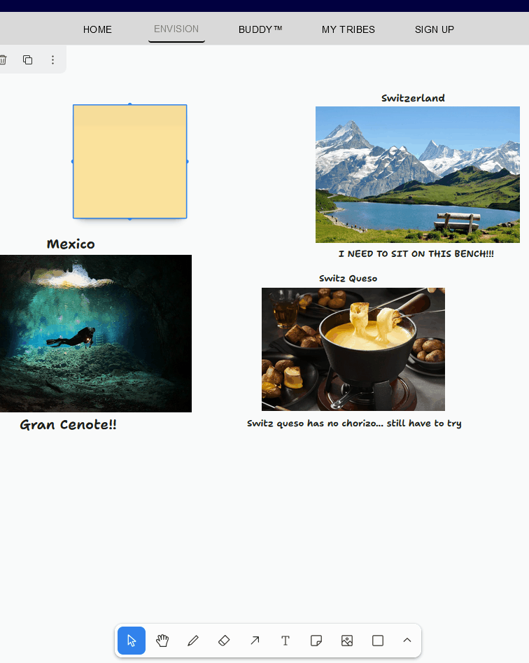
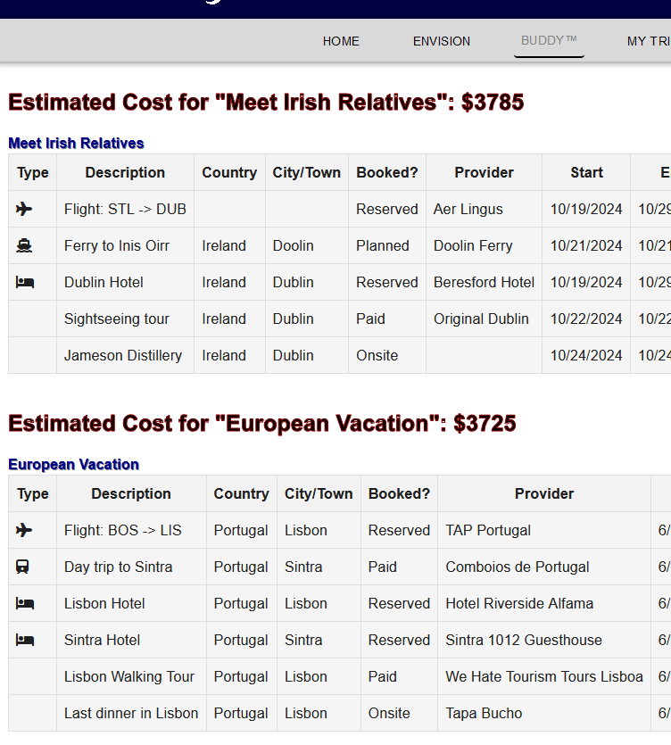

# travel-buddy

## Description

Travel Buddy is a MERN stack application that allows users to create an account and plan trips. Users can envision their trips by adding destinations, activities, and accommodations to a collaborative whiteboard space. Users can budget their trips from ground level up to the total cost of the trip. Travelling has never been easier with Travel Buddy.

### License

GPL v3

[](https://www.gnu.org/licenses/gpl-3.0)

## Features

- User can create an account
- Users can envison trips with the tldraw collaborative whiteboard
- Users can budget their trips
- Users can add/edit destinations, activities, and accommodations to their trips
- Users can join tribes and collaborate on trips

## Mockups

### Deployed Application

[Render Deployment](https://travel-buddy-e7hd.onrender.com/)

### Envision Board



### Buddy Board



## Usage

[GitHub Repository](https://github.com/crestonesoftware/travel-buddy)

1. Clone the repository

```bash
git clone
```

2. Install the dependencies

```bash
npm install
```

3. Create server .env with the following content

```bash
JWT_SECRET=your_secret
```

4. Run the server

```bash
npm run start
```

5. Open the browser and go to http://localhost:3001

## Credits

- Elliot Davis [GitHub](https://github.com/crestonesoftware)
- Adam Mathis [GitHub](https://github.com/adammathis05)
- Jonathan Baldyga [GitHub](https://github.com/JohnnyBaldyga)
- JeffMichael Presto [GitHub](https://github.com/Arcaneghost24)
- Jose Falcon [GitHub](https://github.com/josefalconGH)
